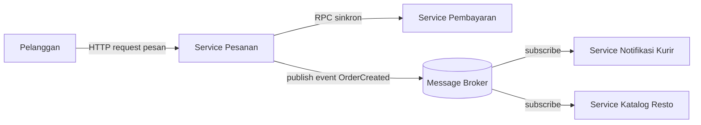

# Tugas 2 (Pekan 2) — Perancangan Arsitektur untuk FoodGo

**Materi terkait:** Architectural style (Layered, SOA, Peer-to-Peer, Publish-Subscribe).

## Studi Kasus

Melanjutkan Tugas 1: FoodGo butuh sistem yang **decoupled** agar tim kurir dan tim resto tidak saling mengganggu ketika salah satu modul diperbarui/deploy ulang. Saat ini semua modul (pesanan, pembayaran, notifikasi kurir, katalog resto) berjalan sebagai satu aplikasi monolitik — sekali deploy, semua modul ikut restart dan berisiko downtime total.

## Tugas Kelompok

1. Pilih **satu** gaya arsitektur utama: **Service-Oriented Architecture (SOA)** atau **Publish-Subscribe**. Boleh dikombinasikan (mis. SOA untuk service inti + Pub-Sub untuk notifikasi), tapi harus dijustifikasi kenapa kombinasi ini yang dipilih.
2. Gambarkan minimal 4 komponen berikut dan interaksinya: modul Pesanan, modul Pembayaran, modul Kurir/Notifikasi, modul Katalog Resto (dan message broker/API gateway jika relevan).
3. Jelaskan alur satu skenario penuh secara end-to-end di diagram (misalnya: pelanggan buat pesanan → bayar → resto terima notifikasi → kurir ditugaskan) — tunjukkan komponen mana berkomunikasi dengan siapa, dan **jenis komunikasinya** (sinkron/asinkron, request-response/event).
4. Analisis tertulis: kenapa gaya ini mengatasi masalah *coupling* dari Tugas 1, dan apa trade-off-nya (mis. Pub-Sub menambah kompleksitas debugging karena alur tidak linear).

## Cara Membuat Diagram (Gratis, Cukup Laptop)

Tidak perlu software berbayar. Dua opsi:

**Opsi A — Mermaid di dalam Markdown (disarankan).** Ditulis sebagai teks biasa di `README.md`, otomatis dirender jadi diagram oleh GitHub — tidak perlu install apa pun.

````markdown

```mermaid
graph LR
  Client[Pelanggan] -->|HTTP request pesan| OrderSvc[Service Pesanan]
  OrderSvc -->|RPC sinkron| PaymentSvc[Service Pembayaran]
  OrderSvc -->|publish event OrderCreated| Broker[(Message Broker)]
  Broker -->|subscribe| NotifSvc[Service Notifikasi Kurir]
  Broker -->|subscribe| RestoSvc[Service Katalog Resto]
```
````

**Opsi B — draw.io / diagrams.net** (gratis, jalan di browser tanpa akun, atau app desktop offline di [app.diagrams.net](https://app.diagrams.net/)). Ekspor sebagai `.png` dan simpan di folder `diagram/`.

## Hasil Jawaban

** diagram mermaid.(Galang)
````mermaid 
graph TD
    Client([Pelanggan / Mobile App])

    subgraph Entrypoint [API]
        Gateway[API Gateway]
    end

    subgraph Publisher
        P1[Pesanan]
        P2[Pembayaran]
    end

    subgraph Message_Broker [Message Broker - Kafka / RabbitMQ]
        TopicOrder{Topic: 'order-created'}
        TopicPayment{Topic: 'payment-success'}
    end

    subgraph Subscribers
        Q1[Modul Katalog Resto]
        Q2[Modul Notifikasi & Kurir]
    end

    %% Pemesanan
    Client -->|Memesan makanan via HTTP POST| Gateway
    Gateway -->|Mengirimkan request pesanan| P1

    %% Event Order Dibuat
    P1 -->|Mempublish 'order-created'| TopicOrder
    TopicOrder -->|Mengantarkan event ke pembayaran| P2

    %% Pembayaran
    Client -.->|Membayar dengan beberapa metode pembayaran| P2
    P2 -->|Mempublish 'payment-success'| TopicPayment

    %% Penyaluran Event ke Resto dan Kurir
    TopicPayment -->|Kirim ke modul resto agar dibuatkan makanan| Q1
    TopicPayment -->|Mencari driver & kirim notifikasi| Q2
````
**penjelasan alur(Rizki)
1.

**Analisis Tertulis(Faiz)

Dengan memilih arsitektur **Microservices menggunakan pola Publish-Subscribe (Pub-Sub)** yang didukung *Message Broker* (misalnya Apache Kafka atau RabbitMQ), cara modul-modul berkomunikasi berubah secara mendasar. Alih-alih menggunakan pola *request-response* yang sinkron, sekarang kita memakai pola *event-driven* yang asinkron. Cara ini langsung mengatasi masalah skalabilitas dan *cascading failure* yang pernah dialami FoodGo ketika masih memakai arsitektur monolitik sebelumnya.

### 1. Bagaimana Pub-Sub Mengatasi Masalah *Coupling* (Ketergantungan)

Di arsitektur monolitik yang dibahas di Tugas 1, sistem mengalami **Tight Coupling** (ketergantungan erat). Modul Pesanan harus memanggil Modul Pembayaran langsung dan menunggu (*blocking*) sampai proses selesai. Pola Pub-Sub menyelesaikan masalah ini lewat dua mekanisme isolasi:

* **Fault Isolation (Temporal Decoupling):** Modul-modul sekarang tidak lagi menunggu satu sama lain secara *real-time*. Ketika pembayaran berhasil, Modul Pembayaran cukup mempublikasikan *event* `payment-success` ke *Message Broker* dan langsung melepaskan *resource* (CPU/Thread) untuk melayani transaksi lain. Jika Modul Notifikasi Kurir sedang bermasalah atau lambat, Modul Pembayaran tidak terpengaruh sama sekali. Pesan akan tersimpan aman di antrean (*queue*) *Broker* hingga Modul Kurir kembali stabil dan siap memprosesnya.

* **Deployment Isolation (Spatial Decoupling):** Karena modul-modul tidak lagi terikat dalam satu proses (berada di kontainer/server berbeda) dan berkomunikasi lewat *Broker*, pembaruan sistem menjadi lebih fleksibel. Tim *engineer* Katalog Resto dapat merilis ulang modul mereka di tengah hari tanpa perlu memulai ulang Modul Pesanan atau Pembayaran. Ini menghilangkan risiko *downtime* total karena pembaruan satu fitur kecil.

### 2. Trade-off dan Kompleksitas Baru Arsitektur Pub-Sub

Walaupun membantu ketersediaan dan skalabilitas, penerapan Pub-Sub menambah lapisan kompleksitas yang tidak ada pada sistem monolitik. Solusi ini mengharuskan tim *engineering* menghadapi beberapa kompromi (*trade‑off*):

* **Kompleksitas Debugging dan Tracing:** Pada aplikasi monolitik, alur eksekusi bersifat linear; melacak *bug* dapat dilakukan dengan membaca log dari atas ke bawah. Pada sistem Pub-Sub, alur data bersifat non‑linear dan tersebar di berbagai *service*. Jika sebuah pesanan gagal mendapatkan kurir, tim harus melacak log di berbagai *service* yang berbeda. Hal ini memaksa tim untuk menambahkan *Distributed Tracing* (misalnya menempelkan *Correlation ID* unik pada setiap pesanan) agar pergerakan *event* dapat dilacak secara *end-to-end*.

* **Tantangan Eventual Consistency (Konsistensi Tertunda):** Sistem tidak lagi diperbarui secara instan. Ada jeda waktu (latensi jaringan) antara saat pelanggan melihat layar “Pembayaran Berhasil” dan saat Modul Katalog Resto menerima *event* tersebut. Sistem berada dalam status *Eventual Consistency* (akan konsisten pada akhirnya, namun tidak seketika). Hal ini menuntut penyesuaian di sisi UI/UX agar pelanggan tidak merasa aplikasi macet saat status pesanan belum berubah di sisi resto.

* **Risiko Duplikasi Pesan dan Syarat Idempotensi:** Infrastruktur jaringan tidak selalu sempurna. *Message Broker* umumnya beroperasi dengan prinsip pengiriman *At-Least-Once Delivery*, yang berarti jika terjadi gangguan koneksi singkat, *Broker* mungkin mengirimkan *event* `payment-success` yang sama dua kali. Untuk mencegah resto memasak dua pesanan yang sama atau sistem memanggil dua kurir untuk satu order, setiap modul penerima pesan (*subscriber*) wajib dirancang bersifat **Idempotent**—yaitu mampu mengenali dan mengabaikan *event* duplikat tanpa mengubah *state* secara ganda.

* **Perpindahan Titik Kegagalan (New SPOF):** Arsitektur ini sangat bergantung pada ketersediaan *Message Broker*. Jika *Broker* tumbang dan tidak dikonfigurasi dengan mode klaster (*High Availability*), seluruh aliran komunikasi asinkron akan terhenti, menjadikan *Broker* tersebut sebagai *Single Point of Failure* yang baru. Hal ini membutuhkan manajemen infrastruktur tambahan yang lebih kompleks.

## Struktur Submission

```
tugas-02-perancangan-arsitektur/
├── README.md          # Analisis + diagram Mermaid (jika Opsi A) atau referensi ke diagram/
├── JURNAL.md
└── diagram/            # File .png/.drawio jika pakai Opsi B
```

## Rubrik Penilaian (Tugas 2)

| Komponen | Bobot | Kriteria |
|---|---|---|
| Ketepatan pemilihan gaya arsitektur | 20% | Justifikasi SOA/Pub-Sub sesuai kebutuhan *decoupling* di skenario |
| Kelengkapan & kejelasan diagram | 30% | Semua komponen kunci ada, jenis komunikasi (sinkron/asinkron) jelas ditandai |
| Analisis trade-off | 30% | Bukan hanya kelebihan — kekurangan/kompleksitas baru juga dibahas |
| Proses & kontribusi kelompok | 20% | `JURNAL.md`, commit history |

## Batasan Penggunaan AI (Level 2)

Kebijakan **Level 2 (AI Assisted Idea Generation & Structuring)** berlaku — lihat [`../RUBRIK-UMUM.md`](../RUBRIK-UMUM.md). Boleh memakai AI untuk brainstorming komponen apa saja yang umum ada di gaya arsitektur SOA/Pub-Sub; **tidak boleh** meminta AI menggambar diagram final atau menuliskan analisis trade-off yang tinggal ditempel. Catat pemakaian AI di "Log Penggunaan AI" pada `JURNAL.md`.

- Diagram Mermaid/draw.io yang "terlalu generik" (identik dengan contoh tutorial di internet tanpa penyesuaian ke kasus FoodGo) akan dinilai rendah pada komponen kelengkapan & kejelasan diagram.
